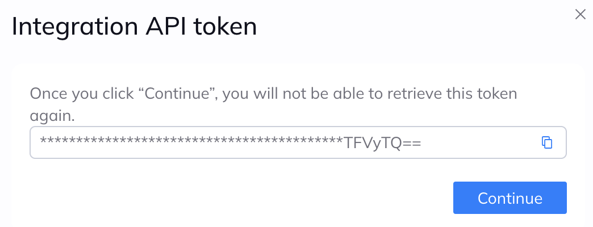
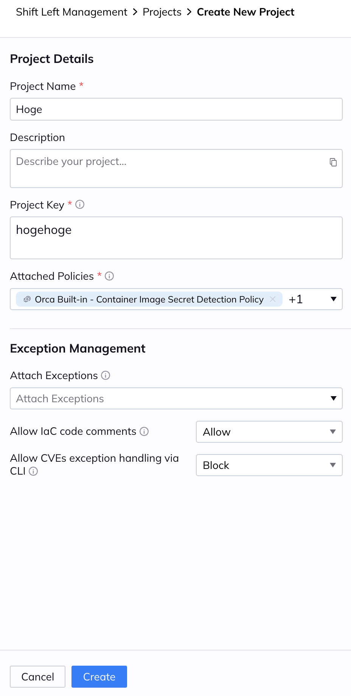
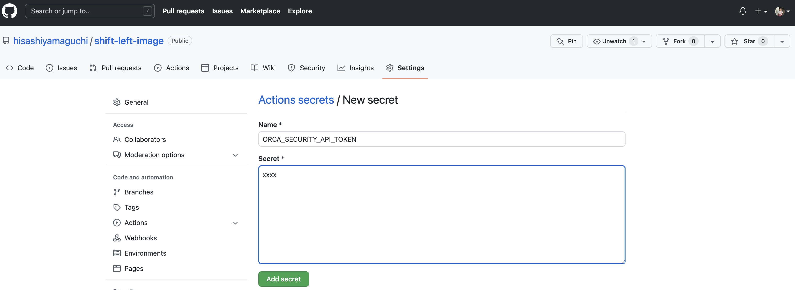
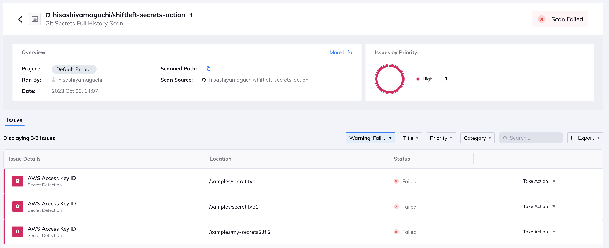

# Orca Security - Secrets Detection witha Shift Left Security quick start guide
Any secrets should be detected in early phases of SDLC! The sample repo gives you how you can demo Orca Security's secrets detection capability in 2 minutes!
<br>
<br>


## Prerequisites
- Orca Security free trial license - visit [Orca Security](https://orca.security/lp/cloud-security-risk-assessment/) if you don't have a free trial license.
- GitHub account.
- MacBook with GitHub CLI.
<br>
<br>


## Set-up
Go Orca dashboard, and click "Users & Permissions" -> "API" on the left pane. Click "+Add API Token" on the top right, and put your favalint name and click "Add". Grab your API key.
<br>
<div align="center">

</div>
<br>

Click "Shift left" -> "Management" on the left pane and go "Projects". Click "Create New" on the top right, and put your favalit project name & key - the valu of "Project Key" should be unique and it will be your project key that you should put on your workflow.yaml. Click "Attached Policies" and select "Orca Built-in - Container Image Secret Detection Policy" and "Orca Built-in - Source Code Secret Detection Policy" - those policies are the ones that can detect secrets on source codes & images. Click "Create" on the bottom.
<br>
<div align="center">

</div>
<br>

Folk the repo, and go "Settings" -> "Secrets" -> "Actions". Click "New repository secret", and put "ORCA_SECURITY_API_TOKEN" on Name field and put the API Token value on Secret field, and click "Add secret".
<div align="center">

</div>
<br>

[Go GitHub Actions workflow yml](https://github.com/hisashiyamaguchi/shiftleft-secrets-action/blob/master/.github/workflows/secrest-action.yaml), and put your Project key that you just specified on Orca dashboard.
```yml
name: Test Orca Secrets action

on: [push, pull_request, workflow_dispatch]

jobs:
  secrets_scan_job:
    runs-on: ubuntu-latest
    steps:
      - name: Checkout
        uses: actions/checkout@v3
        with:
          fetch-depth: 0
  
      - name: Scan Secrets
        id: orcasecurity
        uses: ./
        with:
          api_token:
            ${{ secrets.ORCA_SECURITY_API_TOKEN }}
          project_key:
            "default"
          console_output: "table"
```
<br>
<br>


## Demo!
1. Explain the concept of DevSecOps to your audiences with short words, and expain the demo platform & prerequisite.
2. Show [samples/secret.txt](https://github.com/hisashiyamaguchi/shiftleft-secrets-action/blob/master/samples/secret.txt). The file has secrets!
3. Go back to Orca console, and show your policy. "Orca Built-in - Source Code Secret Detection Policy". This is the policy that going to be applied to this demo repo.
4. Clone the repo to your local laptop. Go the repo directory and any codes - README.md is the easiest.
5. Commit the change locally and push the commit to remote repo - GitHub Actions workflow will be triggered, and start buiding&scanning the poetry.lock.
6. Orca Security is going to detect the policy violation, and the scanning will be fail - the reason is you have secrets on your source codes!
7. Visit Orca dashboard, and click "Shift Left" -> "Management". Go "Scan Log" and show the latest log and say "your source codes should not have any secrets!"
<div align="center">

</div>
<br>
<br>

## Issue Reporting
If you have found a bug or if you have updates request, please report raise a Pull Request.
